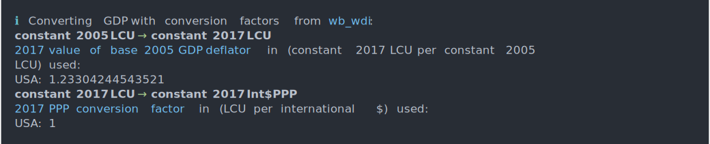

<!-- README.md is generated from README.Rmd. Please edit that file -->

# GDPuc

<!-- badges: start -->

[](https://github.com/johanneskoch94/GDPuc/actions/workflows/R-CMD-check.yaml)
[](https://codecov.io/gh/johanneskoch94/GDPuc)
<!-- badges: end -->

GDPuc (a.k.a. GDP unit-conversion) provides a single function to convert
GDP time-series data from one unit to another. All common GDP units are
supported, i.e.:

-   current LCU
-   current US$MER
-   current Int$PPP
-   constant YYYY LCU
-   constant YYYY US$MER
-   constant YYYY Int$PPP

where “YYYY” is a placeholder for a year, e.g. “2010” or “2015”.

## Installation

There currently only exists the development version on github.

Open a R session on your machine and use the `remotes` package to
install GDPuc.

``` r
# Install remotes if necessary:
install.packages("remotes")

# Install GDPuc from github:
remotes::install_github("johanneskoch94/GDPuc")
```

## Usage

Load the package.

``` r
library(GDPuc)
```

The main function of the package is `convertGDP`.

``` r
convertGDP(
  gdp = gdp, 
  unit_in = "constant 2005 LCU", 
  unit_out = "constant 2017 Int$PPP"
)
```

Here, the `gdp` argument takes a tibble or a data-frame that contains,
at least:

-   a column with iso3c country codes, (ideally named “iso3c”)
-   a column with the year, (ideally named “year”)
-   a column named “value”, with the gdp data

A corresponding magpie object, see the
[magclass](https://github.com/pik-piam/magclass) package, is also
accepted.

Use the `source` argument to control the source of the underlying
conversion factors (GDP deflators, MERs and PPPs). There are a couple of
source options shipped with the package, with `wb_wdi` set as default,
but custom sources are possible.

``` r
convertGDP(
  gdp = gdp, 
  unit_in = "constant 2005 LCU", 
  unit_out = "constant 2017 Int$PPP",
  source = "wb_wdi"
)
```

Use `print_source_info` to print information on a specific, or all
available sources.

``` r
print_source_info()
print_source_info("wb_wdi")
```

Set the `verbose` argument to `TRUE` to print out the underlying
conversion steps and factors. The verbosity can also be controlled via
the option `"GDPuc.verbose"`.

``` r
convertGDP(
  gdp = gdp, 
  unit_in = "constant 2005 LCU", 
  unit_out = "constant 2017 Int$PPP",
  verbose = TRUE
)
```

## Example

``` r
library(GDPuc)

gdp <- tibble::tibble(
  iso3c = "USA", 
  year = 2010:2014, 
  value = 100:104
)
print(gdp)
#> # A tibble: 5 x 3
#>   iso3c  year value
#>   <chr> <int> <int>
#> 1 USA    2010   100
#> 2 USA    2011   101
#> 3 USA    2012   102
#> 4 USA    2013   103
#> 5 USA    2014   104

convertGDP(
  gdp = gdp, 
  unit_in = "constant 2005 LCU", 
  unit_out = "constant 2017 Int$PPP"
)
#> # A tibble: 5 x 3
#>   iso3c  year value
#>   <chr> <int> <dbl>
#> 1 USA    2010  123.
#> 2 USA    2011  125.
#> 3 USA    2012  126.
#> 4 USA    2013  127.
#> 5 USA    2014  128.
```

Setting `verbose = TRUE` will additionally print the following
information to the console:

``` r
convertGDP(
  gdp = gdp, 
  unit_in = "constant 2005 LCU", 
  unit_out = "constant 2017 Int$PPP",
  verbose = TRUE
)
```


